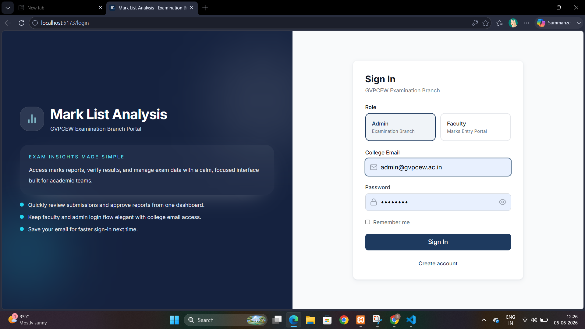
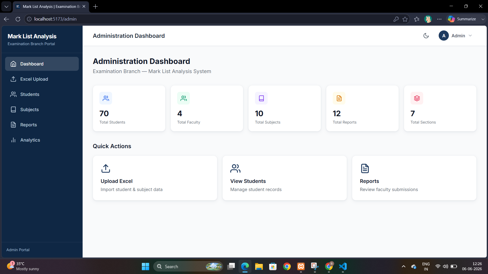
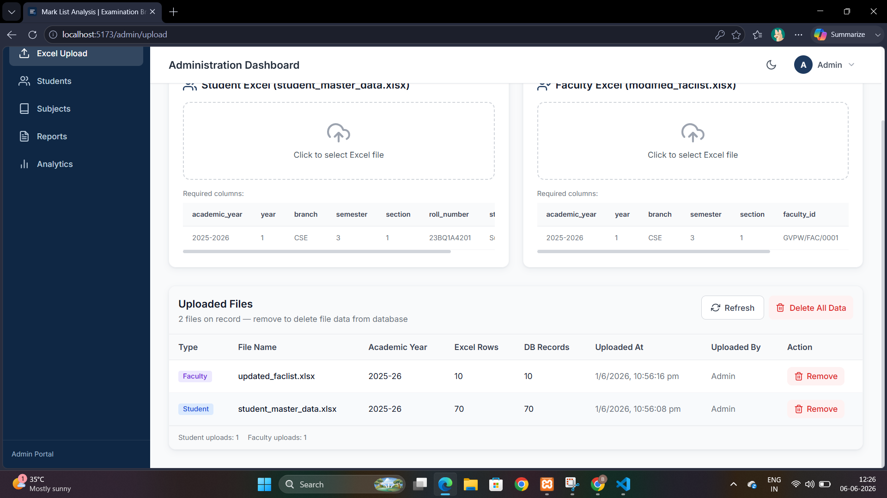
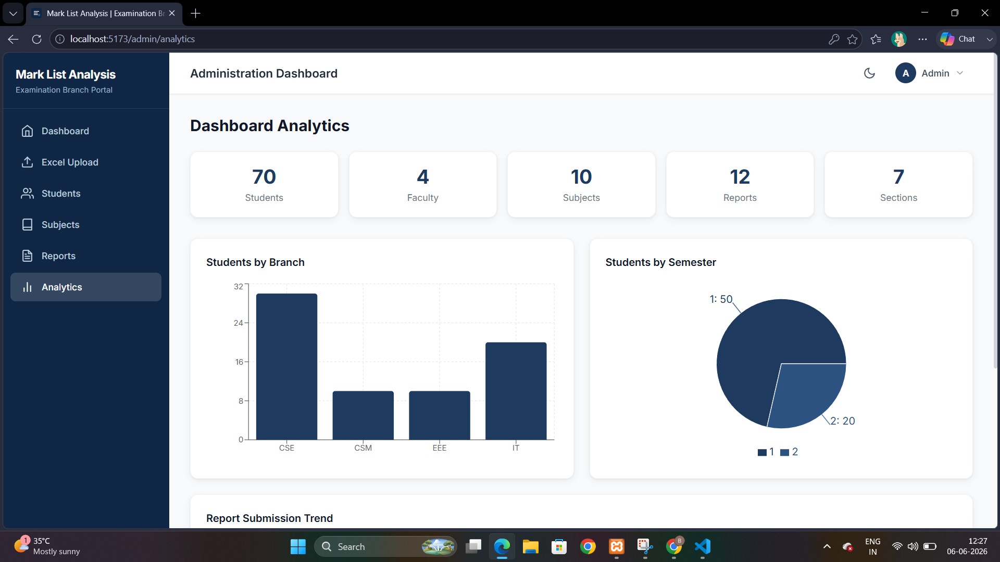
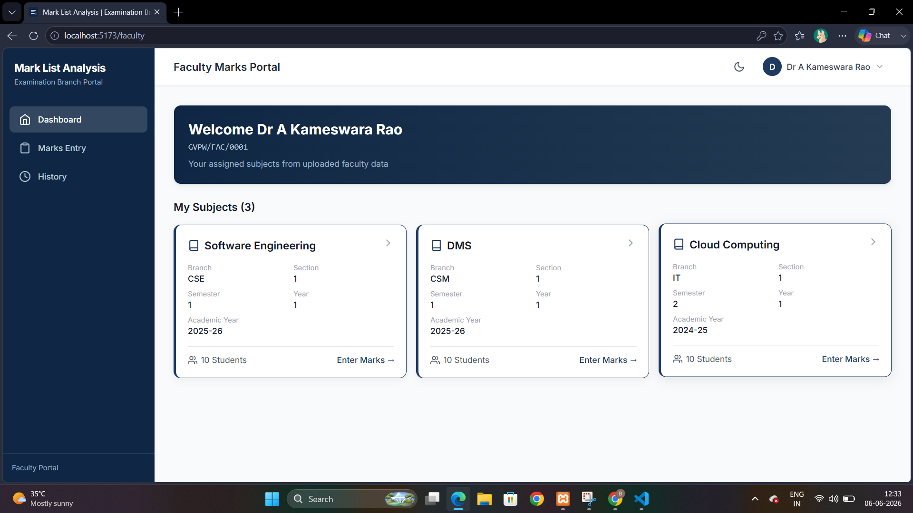
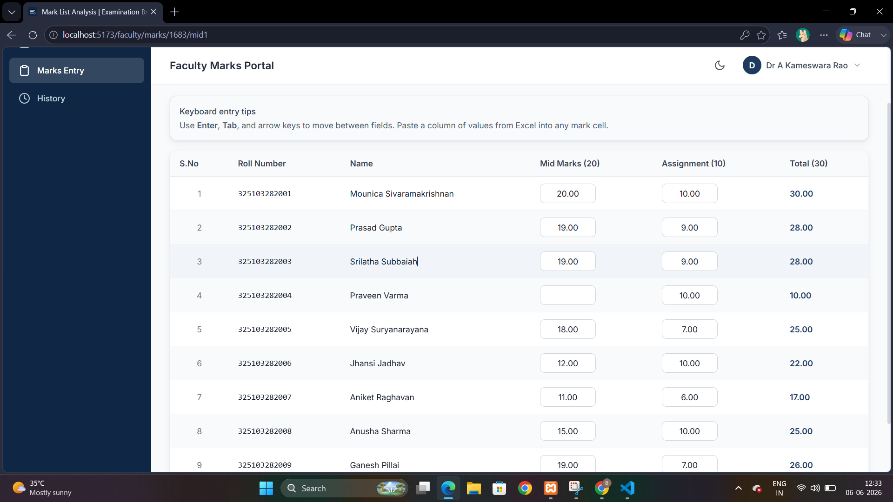
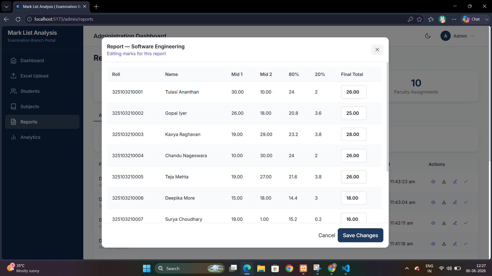
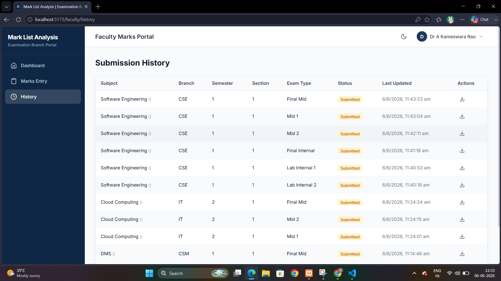
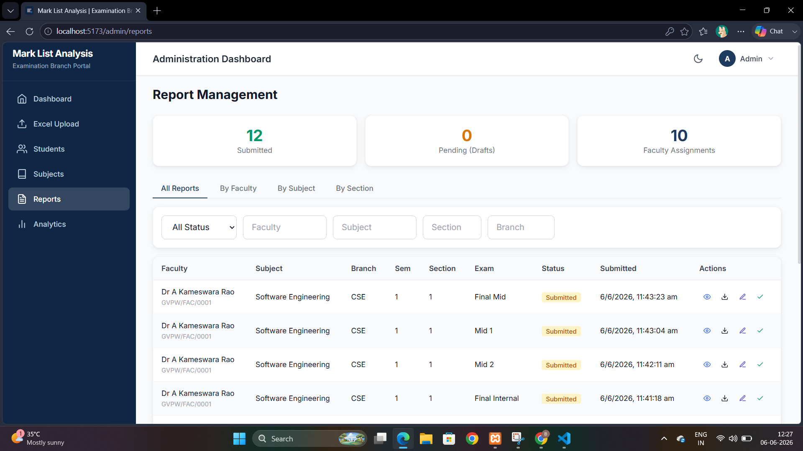

# Mark List Analysis

Institutional academic marks management portal for colleges and universities — Examination Branch ERP system.

## Core Rule

**Only marks are entered manually.** All student, subject, and faculty data is imported via Excel upload or auto-generated from the database.

# 🎓 Mark List Analysis ERP

A full-stack ERP system for managing academic marks, faculty assignments, report generation, and examination workflows in colleges and universities.

## ✨ Features

- 🔐 JWT Authentication (Admin & Faculty)
- 📂 Excel Upload for Students & Faculty
- 👨‍🏫 Faculty Subject Assignment
- 📝 Smart Marks Entry Portal
- 📊 Dashboard Analytics
- 📈 Automatic Final Mid Calculation (80% + 20%)
- 📄 Report Generation & Review
- 📥 Excel Export
- 💾 MySQL Database Integration

## Tech Stack

| Layer | Technologies |
|-------|-------------|
| Frontend | React, Tailwind CSS, Framer Motion, React Router, Axios, Recharts |
| Backend | Node.js, Express.js |
| Database | MySQL |
| Auth | JWT + bcrypt |
| Files | Multer, XLSX |

## Prerequisites

- Node.js 18+
- MySQL 8+

## Setup

### 1. Database

XAMPP MySQL typically runs on port **3307**. Set `DB_PORT=3307` in `backend/.env`.

```bash
mysql -u root -p -P 3307 < database/schema.sql
```

### 2. Backend

```bash
cd backend
cp .env.example .env
# Edit .env with your MySQL credentials
npm install
npm run dev
```

Server runs at `http://localhost:5000`

### 3. Frontend

```bash
cd frontend
npm install
npm run dev
```

App runs at `http://localhost:5173`

## Database migration (required after initial schema)

```bash
mysql -u root -p -P 3307 < database/migrations_v2.sql
```

## Authentication (GVPCEW)

- **Admin:** `@gvpcew.ac.in` email + password
- **Faculty:** `@gvpcew.ac.in` email + password + Faculty ID (`GVPW/FAC/0001`)

## Excel Upload (two separate files)

**Student Excel**

| academic_year | year | branch | semester | section | roll_number | student_name |
| 2025-2026 | 1 | CSE | 3 | 1 | 23BQ1A4201 | Surya |

**Faculty Excel**

| academic_year | year | branch | semester | section | faculty_id | faculty_name | subject |
| 2025-2026 | 1 | CSE | 3 | 1 | GVPW/FAC/0001 | Ramesh | DBMS |

Faculty and students are mapped by: `academic_year` + `year` + `branch` + `semester` + `section`.

## Roles

### Admin
- Excel upload (students, subjects, faculty mapping)
- Student CRUD with search/filter/pagination
- Subject management
- Report review, approve, download
- Dashboard analytics (bar, pie, line charts)

### Faculty
- Select exam type: Mid-1, Mid-2, Lab-1, Lab-2, Final Mid, Final Lab
- Auto-loaded subject assignments
- Auto-generated marks sheets (roll no, names, serial numbers)
- Enter written (≤20) + assignment (≤10) or lab marks only
- Final Mid: Higher×0.8 + Lower×0.2
- Final Lab: Best of Lab-1 and Lab-2
- Save draft, submit, export Excel

## API Endpoints

| Method | Endpoint | Description |
|--------|----------|-------------|
| POST | /api/auth/signup | Register |
| POST | /api/auth/login | Login |
| POST | /api/admin/upload | Excel upload |
| GET | /api/admin/students | List students |
| GET | /api/admin/analytics | Dashboard stats |
| GET | /api/faculty/subjects | Faculty subjects |
| GET | /api/faculty/marks/:subjectId/:examType | Marks sheet |
| POST | /api/faculty/marks/save | Save/submit marks |

## 📸 Screenshots

### 🔐 Login Page



---

### 📊 Admin Dashboard



---

### 📁 Excel Upload Module



---

### 📈 Analytics Dashboard



---

### 👨‍🏫 Faculty Dashboard



---

### 📝 Marks Entry



---

### ✏️ Edit Marks Entry



---

### 📚 Faculty History



---

### 📋 Assignment Review & Reports




## Project Structure

```
Task/
├── backend/          # Express API
├── frontend/         # React SPA
├── database/         # MySQL schema
└── README.md
```
